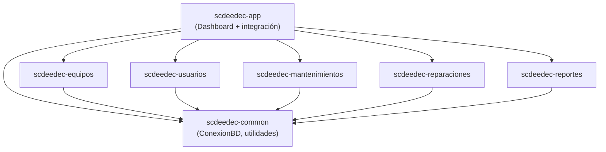
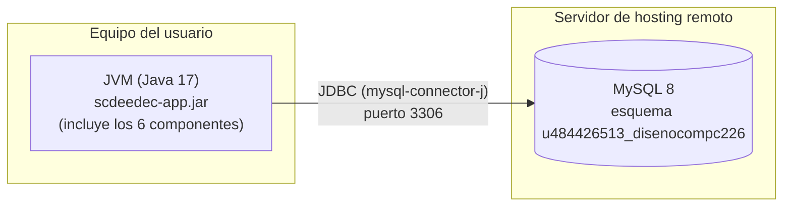

# SCdeEdeC — Sistema de Control de Equipos de Cómputo

Aplicación de escritorio (Java / Swing) para gestionar el ciclo de vida de
los equipos de cómputo de una organización: alta de equipos, asignación a
usuarios, mantenimientos preventivos, reparaciones y reportes generales.

Proyecto final del curso **Diseño y Construcción de Componentes**
(Universidad Cenfotec). Implementa una arquitectura **basada en
componentes**, con cada módulo empaquetado como su propio `.jar` de Maven
e integrado siguiendo el patrón **MVC** (Modelo–Vista–Controlador).

## Tabla de contenido

- [Arquitectura general](#arquitectura-general)
- [Componentes del sistema](#componentes-del-sistema)
- [Diagrama de componentes](#diagrama-de-componentes)
- [Diagrama de despliegue](#diagrama-de-despliegue)
- [Modelo de datos](#modelo-de-datos)
- [Cómo compilar y ejecutar](#cómo-compilar-y-ejecutar)
- [Estructura de carpetas](#estructura-de-carpetas)

## Arquitectura general

El sistema se divide en **6 componentes independientes** (módulos Maven,
cada uno con su propio `pom.xml` y empaquetado como `.jar`), en vez de una
sola aplicación monolítica. `scdeedec-app` es el único módulo que conoce
y depende de todos los demás — los declara como dependencias Maven reales
y su `DashboardController` es quien los invoca — por eso es el
"controlador principal" que integra los componentes.

Dentro de cada componente funcional (equipos, usuarios, mantenimientos,
reparaciones, reportes) se repite la misma organización en capas:

```
modelo/      → entidades de datos (POJOs), sin lógica ni SQL
dao/         → acceso a la base de datos (JDBC puro, sin ORM)
service/     → reglas de negocio y validaciones, antes de tocar el DAO
controller/  → conecta la vista con el service, maneja los eventos
vista/       → JPanel/JFrame de Swing, solo presentación
```

Esto separa claramente la lógica de negocio (service), la presentación
(vista) y el control de flujo (controller) — el patrón MVC pedido por el
enunciado, reforzado además con una capa de servicio y de persistencia
independientes.

## Componentes del sistema

| Componente | Responsabilidad | Clases principales | Depende de |
|---|---|---|---|
| **scdeedec-common** | Utilidades compartidas por todos los demás componentes: conexión a la base de datos, selector de fechas, carga de iconos. | `ConexionBD`, `DatePickerField`, `CalendarioPopup`, `IconUtil` | — |
| **scdeedec-equipos** | Alta, edición, baja y consulta de equipos de cómputo (tipo, marca, modelo, número de serie, estado, ubicación). | `EquipoController`, `EquipoService`, `EquipoDAO`, `EquipoComputo`, `VistaEquipo` | common |
| **scdeedec-usuarios** | Gestión de usuarios y su equipo asignado; valida formato de nombre, apellido y teléfono. | `UsuarioController`, `UsuarioService`, `UsuarioDAO`, `Usuario`, `VistaUsuario` | common |
| **scdeedec-mantenimientos** | Registro de mantenimientos preventivos/correctivos realizados a un equipo (fecha, técnico, descripción). | `MantenimientoController`, `MantenimientoService`, `MantenimientoDAO`, `Mantenimiento`, `VistaMantenimiento` | common |
| **scdeedec-reparaciones** | Ciclo de vida de una reparación: ingreso, diagnóstico, solución, costo, estado (Pendiente / En proceso / Entregado). | `ReparacionController`, `ReparacionService`, `ReparacionDAO`, `Reparacion`, `VistaReparacion` | common |
| **scdeedec-reportes** | Reportes agregados (inventario por estado, equipos por usuario, mantenimientos por rango de fechas) con exportación a CSV. | `ReporteController`, `ReporteService`, `ReporteDAO`, `Reporte`, `VistaReporte` | common |
| **scdeedec-app** | Punto de entrada del sistema: dashboard con el resumen general y el menú lateral que abre cada componente. Es el único módulo que depende de todos los anteriores. | `SCdeEdeCApplication`, `VistaPrincipal`, `VistaDashboard`, `DashboardController`, `DashboardService` | common, equipos, usuarios, mantenimientos, reparaciones, reportes |

## Diagrama de componentes

Refleja las dependencias declaradas en cada `pom.xml`: todos los módulos
funcionales dependen de `scdeedec-common`, y `scdeedec-app` es el único
punto que integra (depende de) todos los demás.



## Diagrama de despliegue

La aplicación es un cliente de escritorio (un único `.jar` ejecutable que
empaqueta los 6 componentes) que se conecta por JDBC a un servidor MySQL
remoto compartido.



## Modelo de datos

Ver [`sql/schema.sql`](sql/schema.sql). Cinco tablas relacionadas por
`idEquipo` (un equipo puede tener un usuario asignado, y puede tener
varios mantenimientos y reparaciones), más una vista (`vw_resumen_general`)
usada por el dashboard y por el componente de reportes.

Las tablas se crean automáticamente la primera vez que se ejecuta la
aplicación (`ConexionBD.inicializarTablas()`, con `CREATE TABLE IF NOT
EXISTS`), así que no hace falta correr el script a mano — se deja
versionado en el repositorio como documentación del modelo de datos.

## Cómo compilar y ejecutar

Requiere Java 17 y Maven (o usar el wrapper `./mvnw` incluido, que no
necesita tener Maven instalado).

```bash
# Desde la raíz del repositorio: compila los 6 componentes y la app
./mvnw clean install

# Ejecuta la aplicación integrada
java -jar scdeedec-app/target/scdeedec-app.jar
```

La primera vez que arranca, `SCdeEdeCApplication` valida la conexión a la
base de datos y crea las tablas si todavía no existen (ver
`application.properties` para los datos de conexión).

## Estructura de carpetas

```
SCdeEdeC/
├── pom.xml                    ← POM padre (agregador de los 6 módulos)
├── scdeedec-common/            ← Utilidades compartidas
├── scdeedec-equipos/           ← Componente: gestión de equipos
├── scdeedec-usuarios/          ← Componente: gestión de usuarios
├── scdeedec-mantenimientos/    ← Componente: mantenimientos
├── scdeedec-reparaciones/      ← Componente: reparaciones
├── scdeedec-reportes/          ← Componente: reportes y exportación CSV
├── scdeedec-app/               ← Integración: dashboard + punto de entrada
└── sql/
    └── schema.sql              ← Modelo de datos documentado
```

